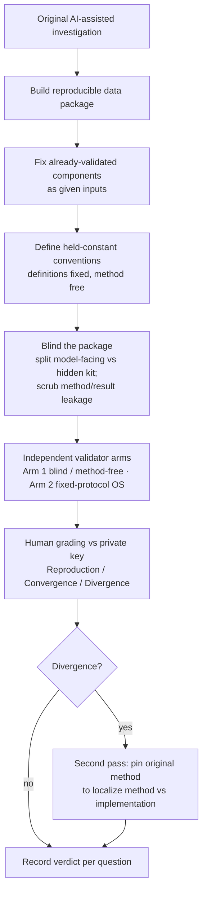

# A Pipeline for Validating AI-Assisted Research Findings

*Process documentation and proposed methodology. This records the workflow we developed to independently validate an AI-assisted investigation (the LoveSmarter / Skopje2 study), generalized into a reusable pipeline. It is intended as the seed for a lab proposal on validating AI-assisted research.*

---

## 1. The problem

When a capable AI model assists with — or largely conducts — a data analysis, the usual quality controls (peer review of code, replication by a second analyst) don't map cleanly onto the new failure modes. Three concerns are specific to AI-assisted analysis:

1. **Silent implementation error.** The model may have cleaned, coded, or computed something subtly wrong in a way that looks plausible and isn't caught by reading the prose.
2. **Analytic-choice fragility.** A finding might hold only under the one method the model happened to pick, and dissolve under an equally defensible alternative.
3. **Anchoring / non-independence.** The obvious way to "check" — show a second model the first model's work — contaminates the check. The second model echoes the first rather than testing it.

The pipeline below addresses all three by running **independent validator models on a blinded, reproducible data package** and grading their output against a held-back key — with an explicit framework that separates "same method, same answer" (reproducibility) from "different method, same answer" (robustness). In its full form it uses more than one validator *arm* (Section 9): a blind, method-free reproducer and a fixed-protocol open-source executor, each probing a different failure mode.

## 2. Core principles

- **Separate the model-facing package from the operator/grader kit.** The validating model sees only what it needs to do the work blind; everything that would reveal the original methods or results is held back.
- **Fix what's already validated; re-test only what's in question.** Components established in earlier work (here, the factor solution) are handed over as fixed inputs, so a disagreement downstream is unambiguously about the analysis under test — not a re-litigation of settled work.
- **Hold definitions constant; vary or fix the method by design.** Construct/operational definitions are always pinned so analyses measure the same thing. The *statistical method* is then either left free (to probe method-independence) or fixed to an agreed protocol (to probe computational reproducibility) — depending on the validator arm.
- **Make the model execute, not just receive.** The validating model applies the fixed definitions to the data itself (computes thresholds, group membership, Ns) — verifying execution, not just method choice.
- **Grade reproduction and convergence differently.** Same-method agreement tests reproducibility; different-method agreement tests robustness; reproducing the numbers on a different model and software stack tests computational reproducibility. All are wins; conflating them muddies the result.
- **Keep the human as grader.** Scoring stays with the researcher, against a private results key — the validating model never grades itself.

## 3. The pipeline

**Stage 1 — Reproducible data package.** Isolate exactly the variables the questions require (here, ~210 of 1,141), preserving record IDs and value labels. Where one analysis is *about* the cases another discards, ship nested subsets (a main analysis set and a strictly larger "excluded-cases" set) rather than one file. Export in multiple formats and verify they are cell-for-cell identical, so format choice never confounds results.

**Stage 2 — Fix validated components.** Provide previously-validated derived quantities (factor scores, composites) as given inputs keyed by record ID, with explicit instruction not to re-derive them. This removes the largest single source of downstream noise.

**Stage 3 — Held-constant conventions.** Pin every operational definition that, if chosen differently, would make results incomparable — group collapses, thresholds, composite definitions, eligibility rules. Document them as *rules* (the model computes the resulting memberships and Ns itself). Distinguish definitions that are result-neutral from any that double as a finding, and decide each deliberately.

**Stage 4 — Blinding.** Split everything into a model-facing package and a hidden operator/grader kit. Scrub the model-facing docs of: the original methods, the original results, target numbers that double as answers, prior figure/question numbering, and any pointers to the source report or full dataset. The hidden kit holds the original methodology, the grading rubric, the rationale for held-constant choices, the staged prompt, and any tooling that could regenerate an answer.

**Stage 5 — Independent re-analysis (one or more validator arms).** Each arm is a *different* model (different lab/vendor where possible) working the questions blind to the original results. Two complementary arms:

- *Method-free arm* — the model chooses its own method per question via a staged negotiation (propose → self-critical second pass → discuss on the merits, without the researcher importing the originals → lock the agreed approach), then executes.
- *Fixed-protocol arm* — an (often open-source) model is handed the agreed methodology and asked only to execute it, with no negotiation.

Both report method-agnostic intermediates (Ns, group means and SDs, cross-tabs, effect sizes and CIs), not just headline p-values.

**Stage 6 — Grading.** The researcher scores each question against the private key: **Reproduced** (same method, numbers match within tolerance), **Converged** (different method, same conclusion), **Diverged**, or **N/A**. Direction must match; magnitude within stated tolerances; relative orderings preserved. Findings flagged fragile in advance (near-threshold, tiny subgroups, data-limited) are noted rather than scored pass/fail.

**Stage 7 — Localize divergences.** Any divergence triggers a second pass with the original method pinned. If it then matches, the disagreement was a method difference (likely both valid — a robustness finding); if it still differs, it's a genuine implementation/data discrepancy to investigate.

## 4. Worked example — LoveSmarter / Skopje2

The original investigation (conducted with Claude Fable 5) answered 13 questions about how relational-security and erotic-exploration needs relate to ideal relationship type, on a cleaned survey sample of 2,074 respondents, using a validated 8-factor solution.

- **Package:** a 2,074-row main subset and a 3,003-row exclusion subset (nested), each in `.sav` / `.csv` / `.pkl`, verified identical; record IDs and SPSS labels preserved.
- **Fixed components:** the 8 factor scores + 6 composites, confirmed byte-identical to the originals, supplied keyed by `ResponseId`.
- **Conventions held constant:** the relationship-type collapses (4-class and the 5-class ideal split, the latter verified to reproduce original group sizes), "partnered," the gender grouping, the top-decile psychopathy criterion, the multi-partner-need composite, and the "wants to change" definition.
- **Blinding:** a model-facing package (data + questions + codebook + glossary + factor inputs + instructions) and a hidden kit (`HIDDEN/`: original methodology, replication rubric, held-constant rationale, staged Codex prompt, factor tooling). Model-facing docs were scrubbed of all report pointers, target counts, and prior numbering.
- **Validators:** Arm 1 — Codex, blind and method-free, via the staged prompt; Arm 2 — an open-weights model executing the fixed protocol (`ANALYSIS_PROTOCOL_arm2.md`), repeatable at no cost. Both blind to the original results.
- **Grading:** human, against the private key, using the Reproduction/Convergence rubric.

## 5. Artifact inventory (role → file)

Files carry an **arm-routing suffix** so it's unambiguous who receives what: `_all` = sent to every arm; `_arm2` = sent only to the fixed-protocol arm. Files inside `validation_subset/` carry no suffix — the whole folder is auto-shared with every arm.

**Model-facing, all arms:** `STUDY_OVERVIEW_all.md`, `INVEST_Qs_OG_all.md`, and `validation_subset/` (`LS_analysis_main_N2074.*`, `LS_exclusion_q1_N3003.*`, `FACTOR_SCORES_N2074.csv`, `FACTOR_LOADINGS_170x8.csv`, `DATA_CODEBOOK.md`, `FACTOR_GLOSSARY.md`, `DATA_SUBSET_OVERVIEW.md`, `VALIDATION_INSTRUCTIONS.md`).

**Model-facing, fixed-protocol arm only:** `ANALYSIS_PROTOCOL_arm2.md` (the locked per-question methods — withheld from the method-free arm, which would be un-blinded by it).

**Operator / grader kit** (`PANEL_VAL/`, withheld from all arms):
`HIDDEN/ORIGINAL_METHODOLOGY.md` (method key), `HIDDEN/REPLICATION_RUBRIC.md` (grading standard), `HIDDEN/HELD_CONSTANT_RATIONALE.md` (design log), `HIDDEN/CODEX_PROMPT.md` (Arm 1 staged prompt), `archive/OS_VAL_PROMPT.md` (Arm 2 execution prompt), `HIDDEN/validate*` (factor tooling), `SCORECARD_*` (graded results), and the full `origin_Fable-5/` (original outputs = the results key).

## 6. What each design choice controls for

| Threat | Control |
|---|---|
| Silent implementation error | Independent re-execution from raw items; required intermediates expose where numbers diverge. |
| Analytic-choice fragility | Free method choice; Convergence across methods is direct robustness evidence. |
| Anchoring / non-independence | Blinding; scrubbed docs; results key withheld; second pass only after the model commits. |
| Sample/derivation confounds | Fixed factor inputs; held-constant definitions; nested verified subsets. |
| Grader leniency / circularity | Human grading against a pre-specified rubric and key; model never self-grades. |

## 7. Limitations and open questions (for the paper)

- **Definitional robustness is only partially tested.** Holding operational definitions constant buys comparability but suppresses one robustness dimension (would the finding survive a different reasonable definition?). A fuller design might vary definitions in a separate arm — a "multiverse" extension.
- **A mild nudge remains.** Handing over a composite (e.g., multi-partner need) signals which construct matters; independent corroboration is slightly weakened wherever a convention doubles as a finding. We logged each such case explicitly.
- **Validator count.** The three-arm design uses two validator models so far; more independent validators (different vendors/architectures), plus repeated runs of the free open-source arm, would let us estimate an inter-model agreement rate and a run-to-run reproduction distribution.
- **Conclusion-matching is partly subjective.** "Same conclusion, different number" requires human judgment; tolerance bands help but are not mechanical. Pre-registering tolerances reduces this.
- **Blinding is imperfect against training overlap.** A validator may have priors about the substantive domain; true blinding covers the specific study, not the field.
- **Generality untested.** This was one study with a clean, already-validated factor backbone. How the pipeline behaves when the contested component *is* the measurement model is an open question.

## 8. Results — validation run (v1 → v2)

The pipeline's first end-to-end run used a second model (Codex) on the LoveSmarter questions. Per-question detail is in `SCORECARD_robustness_GPT-5.5_v1.md` (first pass) and `SCORECARD_robustness_GPT-5.5_v2.md` (after one refinement round); `SCORECARD_GUIDE.md` documents how the scorecard is produced.

**First pass (v1): 10 of 13 agreed** — 4 reproductions (same method, matching numbers) and 6 convergences (a different defensible method, same conclusion). The remaining three were not contradictions: 2 *incompletes* (method gaps — an over-corrective response-style control built from the same items, and the validator reading "don't re-derive the factors" as "run no factor analysis at all") and 1 *divergence* (a small residual "dark-security" jealousy effect the original had itself pre-flagged as fragile).

**After one refinement round (v2): all 13 agree** — 6 reproductions, 7 convergences, zero incomplete, zero diverged. The three flagged questions resolved as follows:

- *Response style:* adding a response-style proxy from **other** instruments yielded an interpretable partial (r = .307) that reproduced the original (~.32) — replacing the uninformative within-pool over-correction.
- *Within-scale vs joint dimensions:* once the fixed-factor constraint was scoped to the joint solution only, an independent per-block factor analysis (different factor counts, chosen by parallel analysis) recovered the headline finding — within-relationship romantic exploration maps onto care/security.
- *Dark-security jealousy:* re-running under the original's specification (top decile vs. everyone else, adjusting for security and gender) reproduced the coefficient to three decimals (b = 0.167, p = .019). The v1 "divergence" was an analytic-choice difference on a fragile effect, not an implementation discrepancy.

Findings of methodological interest for the paper. First, the **reproduction/convergence split worked as intended**: the validator independently chose the same method on some questions and a different-but-defensible one on others, so a single run delivered reproducibility *and* robustness evidence. Second, the **divergence → localizing second-pass** procedure did real work — the one v1 divergence was traced precisely to reference-group and covariate choices and then reproduced exactly, demonstrating that the framework distinguishes "different analytic choice" from "real discrepancy." Third, a blinding instruction ("the factor solution is fixed") was over-applied by the validator and silently suppressed an analysis until clarified — a concrete, recoverable instance of an instruction-design failure mode, with a generalizable fix (scope constraints precisely).

## 9. The proposal — a three-arm validation design

The contribution is less a new statistic than a **protocol**: a reproducible, blinded, multi-model validation procedure with an explicit reproduction-vs-convergence grading framework, for the era where AI does substantial analytic work. The proposed design uses **three arms**, each probing a different failure mode and escalating in how much it constrains the validator:

- **Arm 0 — Origin.** The AI-assisted original analysis (here, Claude Fable 5). This is the work under test, not a validator.
- **Arm 1 — Blind, method-free reproducer.** An independent second model (here, Codex), blind to both the original methods and results, choosing its own method per question. Because it picks freely, a single pass yields *both* reproducibility evidence (where it independently lands on the same method) and robustness evidence (where a different defensible method still converges). This is the arm that surfaces analytic-choice fragility.
- **Arm 2 — Fixed-protocol open-source executor.** An open-weights model (e.g., an OpenRouter free model) given the *agreed* methodology (`ANALYSIS_PROTOCOL_arm2.md`) plus data and context, blind to results, asked only to execute. This tests **computational reproducibility** — whether the numbers survive a change of model *and* software stack — and isolates implementation/stack portability from method choice. Because these models are free, this arm is **repeatable at no cost**: run it many times (one model or several) to get a *distribution* of reproduced estimates, a cheap stability check closed models can't match.

The arms are complementary: Arm 1 varies the method to test whether findings depend on analytic choices; Arm 2 fixes the method to test whether they survive a different computational stack. Together with the origin, they triangulate the three failure modes from Section 1 (silent implementation error, analytic-choice fragility, anchoring/non-independence).

**What each arm is _not_** (so the three aren't read as three tries at the same thing):

- **Arm 1 is not a computational-reproduction check.** Because it may pick a different method, matching numbers are *not* expected; a different method reaching the same conclusion is the win. A numeric mismatch here is not a failure.
- **Arm 2 is not an independent-method check.** It is handed the method, so it cannot speak to whether a finding survives a different analytic choice — only to whether the agreed method reproduces on a different model and software stack.
- **No arm re-tests the measurement model.** The factor solution is a fixed input in every arm (validated separately, earlier); none of them re-derives or re-opens it.
- **No arm is blind to the questions or the data** — only to the original *methods* (Arm 1) and the original *results* (all arms). The validators are not rediscovering the study from scratch.

**Validator-model choice.** Prefer nameable open-weights models for the reported OS arm, so the run is citable and verifiably open. Avoid stealth / cloaked models there — their identity is undisclosed, so you cannot cite them or confirm they are open source (fine for an informal extra run, not for the reported result).

**Next steps for a paper:** formalize the protocol; run all three arms across multiple validators and multiple studies; report inter-model agreement and the reproduction/convergence/divergence breakdown (and, for Arm 2, the run-to-run reproduction distribution); and benchmark the protocol's catch-rate against conventional code review on deliberately seeded errors.
